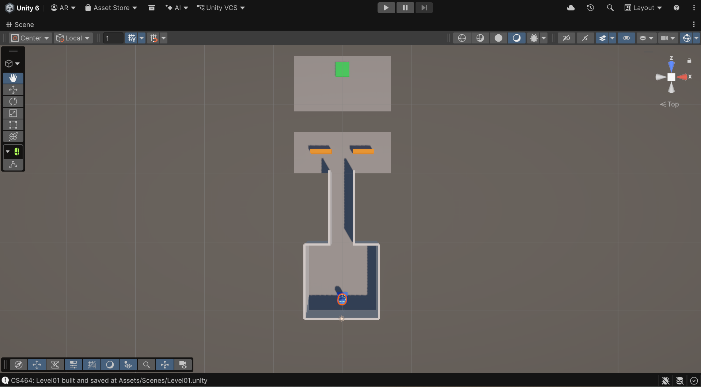
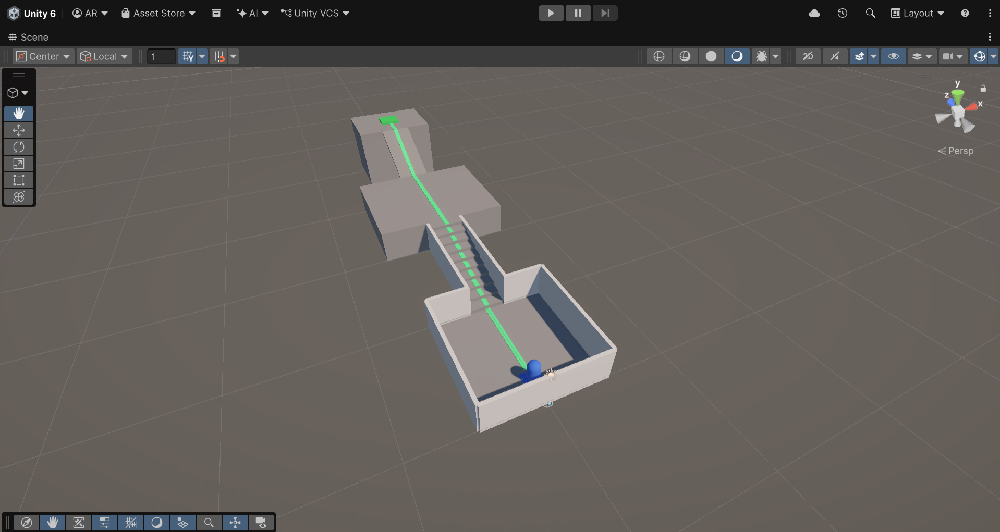
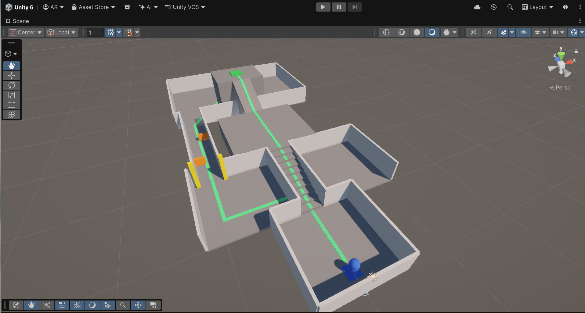
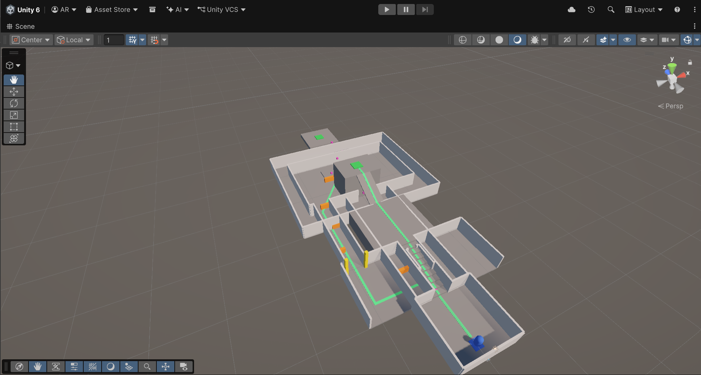

# CS464 Assignment 01 · M. AQIB RAMZAN · BSCS24074

## Game 1 · Subway Surfers
- **Store link:** https://play.google.com/store/apps/details?id=com.kiloo.subwaysurf
- **Genre:** Endless runner
- **I played:** 40 minutes, best score 19334

1. [M1, M4, M6] · Running down the track on a hoverboard, with the score, the x1 multiplier and the hoverboard timer bar on screen.
2. [M3, M5, M7] · Jumping with the super sneakers onto a train roof to collect the coins lying on top.
3. [M2, M5] · Flying with the jetpack past a train and a barrier, with the magnet, sneakers and x2 pick-up icons above.

| # | Mechanic | Dynamic | Aesthetic | Bartle type |
|---|---|---|---|---|
| M1 | Swipe left or right to change between the tracks, up to jump and down to roll. | Players look a few rows ahead and move early to the clear track instead of dodging at the last moment. | Challenge: reading the track and reacting in time is the whole test. | Achiever: beating the track on its own terms. |
| M2 | Running into a train or barrier makes you crash, and that ends the run. | Players stay alert after a near miss and restart straight away after a crash to beat their last run. | Challenge: one crash ends the attempt, so every run is a test. | Achiever: each run is a fresh attempt to survive longer. |
| M3 | Coins lie along the tracks and on train roofs, and are added to a coin counter at the top right. | Players steer towards coin lines, even onto a riskier track or a roof, to keep the counter climbing. | Submission: grabbing coins is a low-effort routine you can do while barely thinking. | Achiever: a growing pile of coins to show progress. |
| M4 | Score rises as you run, and a multiplier badge (x1 at the start) can be raised by pick-ups. | Players try to stay alive and grab pick-ups to push the multiplier up, because a crash ends the run and the score. | Challenge: a score to beat. | Achiever: pushing past a previous best. |
| M5 | Timed power-ups (super sneakers, jetpack, coin magnet, x2 multiplier) run on a bar at the bottom of the screen. | Players use the jetpack to skip a crowded stretch and the sneakers to jump onto roofs. | Sensation: the jetpack flames, flight and speed feel good. | Explorer: finding out what each power-up changes about a run. |
| M6 | A hoverboard can be ridden for a limited time (timer bar at the bottom left) and takes the hit instead of ending the run. | Players switch it on before a crowded stretch and play bolder while it lasts. | Challenge: a safety net lets players take bigger risks. | Achiever: spending a resource to get further. |
| M7 | Trains can be climbed onto with a jump, and their roofs can be run along. | Players hop onto roofs to follow the coin trail above and avoid the crowded tracks below. | Discovery: spotting a route above the obvious path. | Explorer: finding another way through the same track. |

**Aesthetic profile:** Challenge leads (M1, M2, M4, M6) because every run can end on one mistake and a score is there to beat. Sensation comes second (M5), because the jetpack and speed effects feel good. Submission is third (M3), because collecting coins is an easy routine that keeps players running again.

**Player types**
- Primary: Achiever (acting × world), because the player acts on the game's own track and score and there is no other player involved: runs are beaten against the track (M1, M2) and a previous best (M4).
- Secondary: Explorer (interacting × world), because players engage with how the game's systems work: what each power-up changes (M5) and which route over the roofs pays off (M7).

## Game 2 · Bubble Shooter 
- **Store link:** https://play.google.com/store/apps/details?id=bubbleshooter.orig
- **Genre:** Puzzle (bubble shooter)
- **I played:** 35 minutes, reached level 5

1. [M1, M2, M4, M6] · An early board: aiming arrow, the loaded bubble with a spare beside it, the shot counter (20) and the four boosters.
2. [M5, M7] · The level map: stars on the finished levels, locked slots with level numbers, and the coin counter.
3. [M3, M5] · A later board with a cluster just popped, a score of 970, and the star bar starting to fill.

| # | Mechanic | Dynamic | Aesthetic | Bartle type |
|---|---|---|---|---|
| M1 | Aim with the arrow and release to fire the loaded bubble; it sticks to the first bubbles it touches. | Players line the arrow up on the colour group they want and wait for the right angle instead of firing at the nearest bubble. | Challenge: hitting the exact spot takes aim and patience. | Achiever: acting on the board to clear it. |
| M2 | Two bubbles are held at once, the loaded one and a spare beside it, and tapping them swaps their places. | Players swap when the loaded colour matches nothing and keep a useful colour waiting for a better moment. | Challenge: a small choice on every turn decides whether a shot is wasted. | Achiever: setting up a better shot to beat the level. |
| M3 | Shooting a bubble into a group of its own colour pops that group. | Players look for the shot that joins the biggest group instead of the nearest bubble, because larger pops clear more of the board. | Sensation: the burst of sparkles when a group pops is satisfying. | Explorer: working out how the colours and layout react to a shot. |
| M4 | Each level gives a fixed number of shots, shown in the badge beside the shooter (20 on one board, 27 on a later one). | As the number drops, players stop firing quick shots and plan each one so none is wasted. | Challenge: a shrinking budget turns every shot into a decision. | Achiever: beating the level's limit. |
| M5 | Score rises with every pop and fills a three-star bar; the stars earned show on the level map. | Players replay a short level they left with fewer than three stars, then move on, treating it as a quick round. | Submission: short rounds with a small star reward make an easy "one more level" pastime. | Achiever: a ladder of stars to climb. |
| M6 | Four boosters (bomb, aim guide, colour change and a fourth) sit under the shooter; a plus sign means more can be added and a number shows the uses left (colour change shows 2). | Players keep boosters for a board they are stuck on instead of spending them on easy levels. | Challenge: deciding when to spend a limited help is part of the puzzle. | Achiever: spending resources to get past a level. |
| M7 | Levels are played in order along a winding map, and extra features stay locked until set level numbers (5, 30 and 51). | Players keep going through levels to open the locked slots and see what comes next on the map. | Discovery: locked slots and unseen levels invite players to find what lies beyond. | Explorer: engaging with the game's structure to find what unlocks. |

**Aesthetic profile:** Challenge leads (M1, M2, M4, M6), because every shot is limited and aimed and the boosters have to be spent wisely. Sensation is second (M3), because the popping and sparkles feel good. Submission is third (M5), because levels are short and the stars make an easy "one more level" loop.

**Player types**
- Primary: Achiever (acting × world), because the player imposes goals on the board itself, with no other players involved: a limited shot count (M4), three stars (M5) and boosters spent to get past a level (M6).
- Secondary: Explorer (interacting × world), because the player engages with how the game's systems behave: how colours and layouts react to a shot (M3) and what the map unlocks next (M7).

## Level blockouts

| Level | Screenshot | Its idea | Wayfinding tool |
|---|---|---|---|
| Level01 |  | A spawn room, a corridor and a yard, with one 3 m gap to jump before the goal. | Landmark: a tall yellow tower that shows over the walls from the spawn. |
| Level02 |  | Height: ten 0.3 m steps to a raised platform, then a ramp of about 27° up to a goal 6 m above the start. | Leading lines: a green stripe runs from the spawn up the steps and ramp to the goal. |
| Level03 |  | A split route: a short open strip with a 3 m gap, or a long enclosed corridor with low cover to weave around. Both reach the same goal. | Framing: two yellow pillars flank the safe doorway, and a bright green path marks the safe route. |
| Level04 |  | Pinch and release: the route narrows from 3 m to 2.2 m to a 1.6 m open bridge, then opens into a big arena with the goal across it. | Pinch and release: the squeeze hides the goal and the sudden open space reveals it. |
| Level05 |  | A three-lane hall where low cover blocks two lanes on each row, then four 3 m platform jumps that each rise 0.3 m. It combines weaving, gaps and height. | Breadcrumbs: small pink cubes follow the open lane and float over each gap. |
